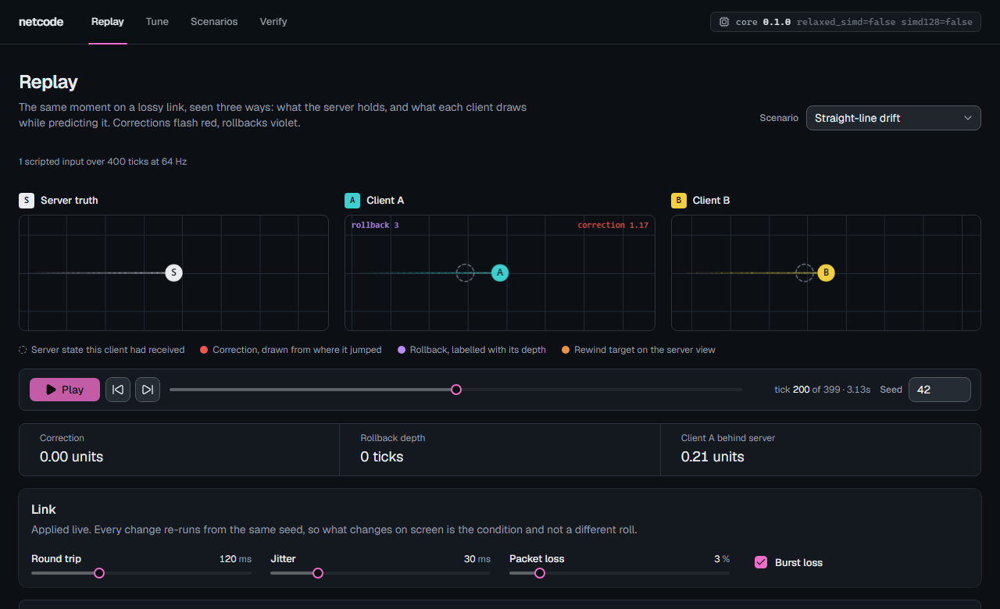
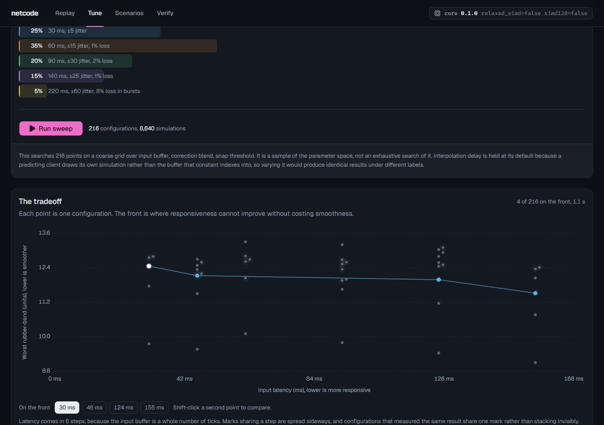
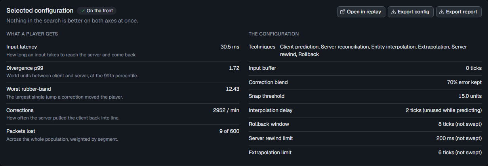
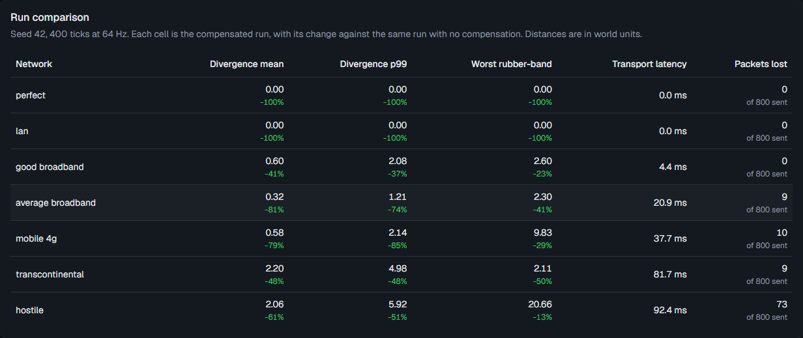
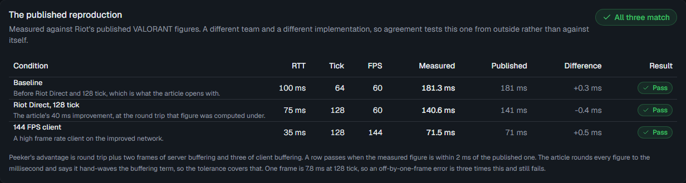
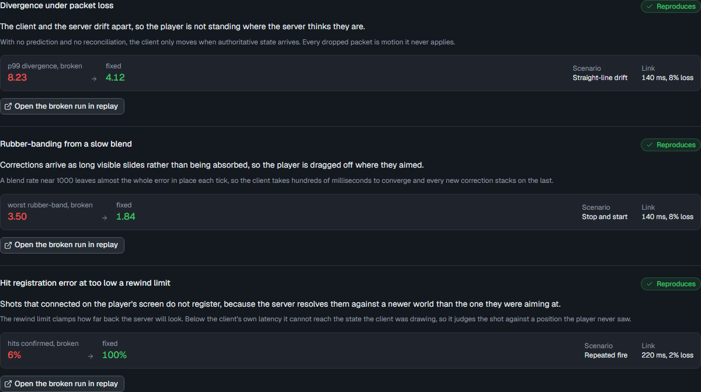
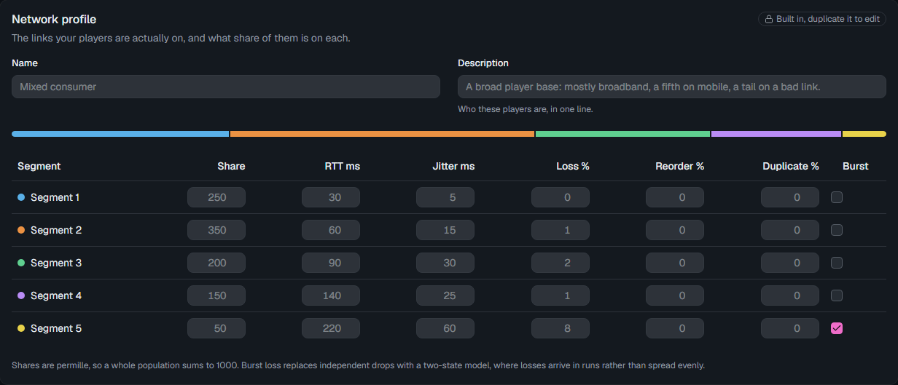

# netcode

> Find the netcode constants your game should ship, by searching them against a deterministic simulation.

<p align="center">
  
  
  
  
</p>

<p align="center">
  
</p>

Every latency compensation technique is a tradeoff with a constant attached, and there is no published guidance on what those constants should be. Interpolation delay, input buffer depth, rollback window, correction blend rate, snap threshold: pick them wrong and players feel it, but the only common way to find out is to ship and read complaints.

This runs the search offline instead. Describe your movement rules and the links your players are actually on, and it sweeps the parameter space against a deterministic simulation, returns the configurations where responsiveness cannot improve without costing smoothness, and replays any one of them so you can watch what the numbers mean.

## How it works

1. A scenario defines one controllable body, its movement constants, and a tick-indexed input script.
2. A network profile defines the population: what share of players sit on which link, with RTT, jitter, loss, reorder and duplication per segment.
3. Every configuration on the grid runs against every seed and every segment, in a pool of Web Workers hosting the WASM core.
4. Results are aggregated by how many players each segment represents, so a rare bad link does not outvote the common case.
5. The Pareto front is the set of configurations nothing else beats on both axes at once.
6. Any point opens in the replay at the exact constants it represents.

## The tradeoff

<p align="center">
  
</p>

216 configurations across 8,640 simulations, in under a second. Input latency comes in
whole ticks of input buffer, so the results fall into six columns rather than scattering;
marks are spread inside their column so none hides another, and configurations that
measured the same result share one mark that says how many it stands for. The front is
connected so the shape of the tradeoff reads immediately.

Hovering a mark reports that mark. Clicking it selects that configuration, shift-clicking
a second compares them, and every mark is reachable from the keyboard.

<p align="center">
  
</p>

## What the techniques buy

<p align="center">
  
</p>

Each preset runs twice on the same seed and the same packet sequence: once with no compensation, once with the techniques on. The difference is what they actually bought on that link, rather than a claim about them in general.

## It is checked against someone else's numbers

<p align="center">
  
</p>

Peeker's advantage is round trip plus two frames of server buffering and three of client buffering. Riot published three figures for VALORANT under known conditions; this model reproduces all three to within half a millisecond. Those numbers come from a different team and a different implementation, so agreement tests this one from the outside rather than against itself.

The tolerance is 2 ms and the check runs in your browser on page load, not from a stored table.

## When it goes wrong

<p align="center">
  
</p>

Each demo runs the same scenario twice on the same seed and link, once with the configuration that causes the failure and once with that cause removed. The numbers are measured on the spot, so a demo that stopped reproducing its own failure would say so rather than keep its caption.

## Determinism

The simulation core is Rust compiled to WebAssembly, using fixed-point arithmetic throughout. That is a requirement rather than a preference: `Math.sin`, `Math.cos` and `Math.pow` are implementation-defined in JavaScript and differ between engines, so a JavaScript core could not promise that the same seed produces the same result twice.

A given seed produces a bit-identical state hash in Chromium, Firefox and Node, checked in CI against hashes recorded from the native Rust build. The verify page shows the current engine's hashes so the property is visible in the app, not just in the test suite.

## Authoring

<p align="center">
  
</p>

Scenarios and network profiles are editable, and the input script can be recorded by driving the body with the keyboard. Built-ins are read-only and duplicable. Everything exports as JSON with a schema version, and an import written by a different version is rejected with its reason rather than loaded with guessed fields.

## Regression checks in CI

A tuned configuration can be pinned as a baseline and rechecked on every commit, so a gameplay change that costs netcode quality fails the build instead of shipping quietly.

```bash
npm run baseline -- baselines/default.json
```

It runs the pinned scenario, network segment, seeds and config, then asserts each metric against its threshold. A threshold that is missed exits non-zero and prints what it measured:

```
FAIL  divergenceP99           measured 1.5818 <= 0.5000  off by +1.0818
pass  correctionMagnitudeMax  measured 3.3223 <= 3.83
```

A baseline pins its own seeds, so the result is exact rather than an estimate. Set thresholds above the values the build measures, not equal to them.

```json
{
  "schemaVersion": 1,
  "name": "Straight-line drift on average broadband",
  "scenarioId": "drift",
  "segmentIndex": 3,
  "seeds": [1, 2, 3, 4, 5, 6, 7, 8],
  "config": { "correctionBlendPermille": 800, "inputBufferTicks": 0 },
  "thresholds": [
    { "metric": "divergenceP99", "comparison": "atMost", "value": 1.82 },
    { "metric": "inputLatencyMeanMs", "comparison": "atMost", "value": 24.3 }
  ]
}
```

## Setup

Requires Node 24+ and the Rust toolchain with the `wasm32-unknown-unknown` target.

```bash
rustup target add wasm32-unknown-unknown
cargo install wasm-pack
npm install
npm run build:wasm
npm run dev
```

## Tests

```bash
npm test
```

Runs the typechecker, the Rust core suite, the TypeScript unit suite, the Node determinism suite, a production build, and the cross-engine browser suite in Chromium and Firefox.

| Layer | Count | What it covers |
| --- | --- | --- |
| Rust core | 216 | Fixed-point arithmetic, the network model, property tests |
| Unit | 212 | Sweep planning, Pareto ordering, playback, palette and motion rules |
| Determinism | 112 | Pinned state hashes, cross-engine agreement, sweep reproducibility |
| Browser | 160 | Every route driven in Chromium and Firefox, plus nine visual baselines |

`npm run test:e2e` is what enforces the determinism claim: the same seed must produce the same state hash in Chromium, Firefox and Node, checked against hashes recorded from the native Rust build.
